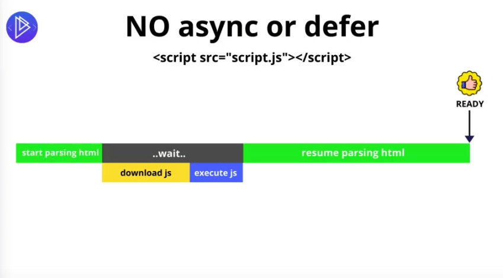
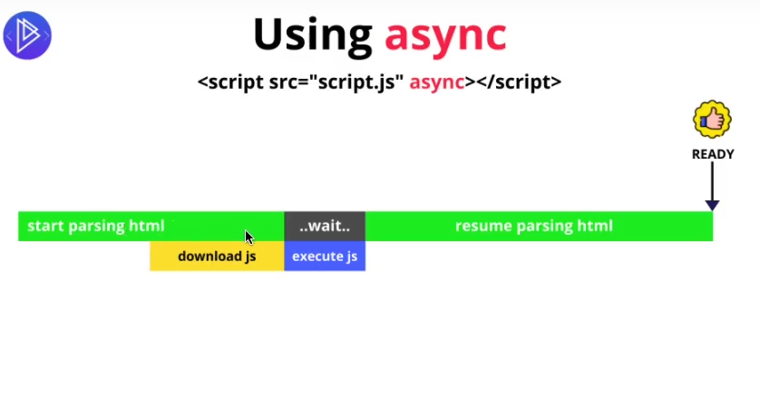
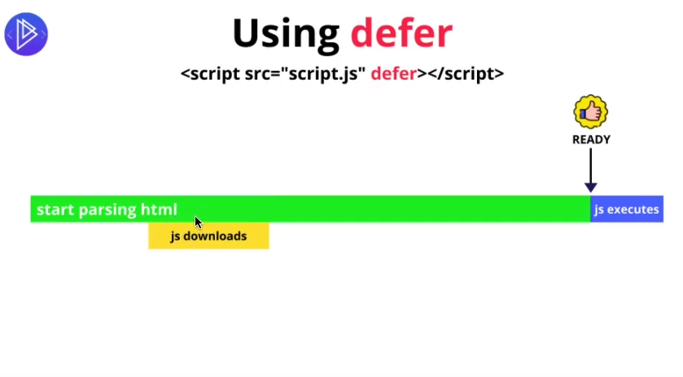
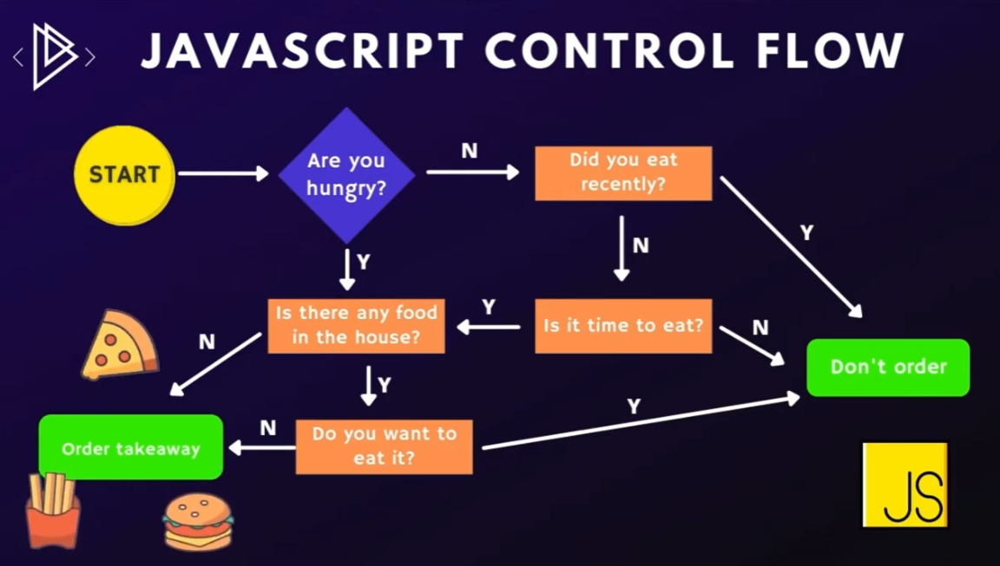
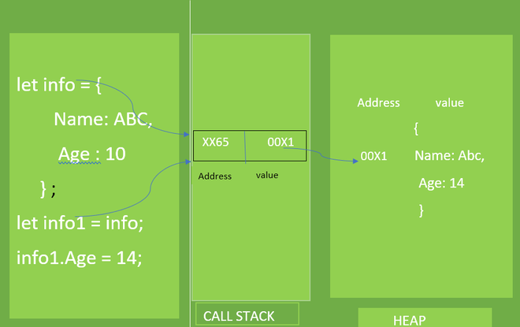
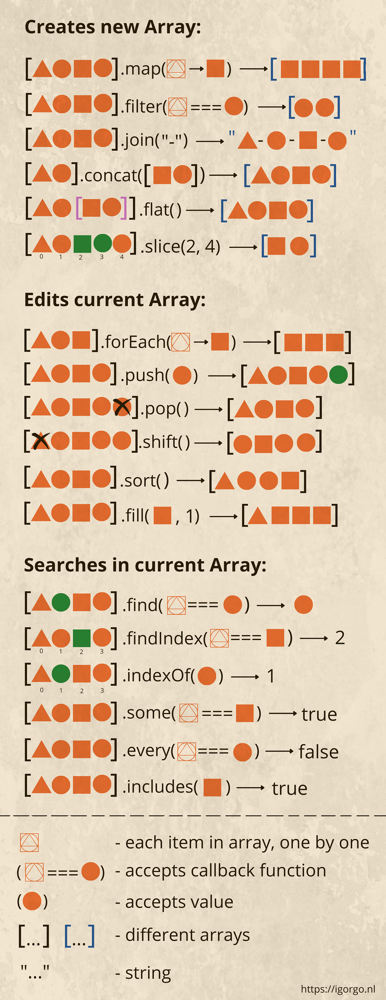
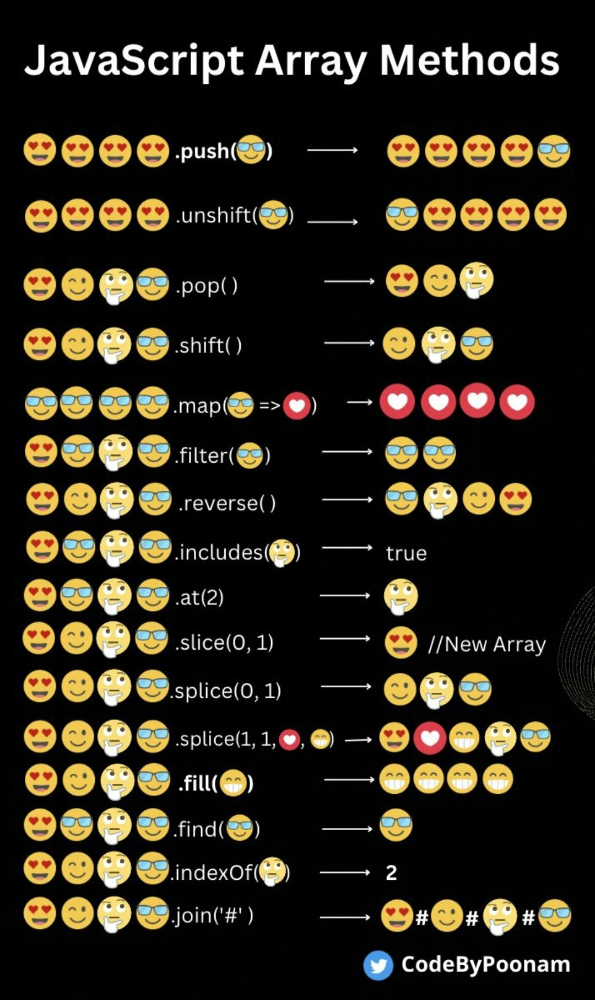

# <h1 style="text-align: center;">JAVASCRIPT</h1>

Javascript est un langage de programmation qui peut être exécuté par le navigateur.

Javascript est le SEUL langage de programmation pouvant être exécuté par le navigateur.

HTML et CSS sont lus et interprétés par le navigateur, mais ils ne sont pas un langage de programmation (qui contient des opérations et des exécutions logiques).

HTML et CSS sont du contenu statique que nous livrons à un navigateur. Javascript est le seul moyen dont nous disposons pour modifier la page de manière dynamique sans modifier les fichiers HTML et CSS d'origine.

### No async or defer :



### async :



### defer :



### Nombres :

```js
let myNumber = 79;
typeof myNumber; // Returns number

2 ** 2; // (2 by the power of 2) Returns 4

Math.round(8.15); // Return 8
Math.round(8.76); // Returns 9

Math.floor(8.9); // Returns 8
Math.ceil(3.1); // Returns 4

// toFixed
let myNumber = 5.379453;
myNumber.toFixed(2); // Returns 5.37
```

##### convertir une chaîne en nombre :

```js
// parseFloat
let myString = "4.786";
parseFloat(myString); // Returns 4.786 (the number, not the string)

// ParseInt
parseInt(myString); // Returns 4
```

##### Et vice versa :
```js
let num = 54;
num.toString(); // Returns "54" (the string, not the number)
```

### Null and Undefined :

***Undefined*** 
- signifie que la variable a été déclarée, mais que sa valeur n'a pas été attribuée.

### logical operator :

- **AND &&**
- **OR ||**
- **NOT !**

### falsy and thruty values :

Certaines valeurs, dans une comparaison, sont toujours considérées comme fausses. Ceux-ci sont :

- la valeur **false**
- une chaîne **vide ""**
- **undefined**
- **null**
- **NaN** (Pas un numéro)
- le nombre **0**

    > Toute autre valeur est considérée **truthy**

### Comparison :

Tha main comparison operators are :

- more than `>`
- less than `<`
- equals to `==` (independent of data type. So `4 == "4"` is true.)
- strictly equals to `===` (dependant of data type. So `4 === "4"` is false)
- not equal to `!=`
- strictly not equals to `!==`
- more than or equal to `>=`
- less than or equal to `<=`
- strictly more than or equal to `>==`
- strictly less than or equal to `<==`

### Conditions :

```js
// IF, ELSE IF, ELSE
if(condition1){
    //code
}else if(condition2){
    //code
}else{
    //code
}

// Normal IF ELSE :
if (laundry === "dirty") {
  cleanLaundry();
} else {
  watchTv();
}

// With ternary operator :
laundry === "dirty" ? cleanLaundry() : watchTv();

//Swith :
let variable = "valeur2";
switch (variable) {
    case "valeur1":
        //code
        break;
    case "valeur2":
        //code
        break;
    default:
        //code
        break;
}

//OU ex :
let today = new Date().toLocaleString('default', {weekday: 'short'});
switch (true) {
    case today === 'Mon':
        //code
        break;
    case today === 'Tue':
        //code
        break;
    case today === 'Wed':
        //code
        break;
    case today === 'Thu':
        //code
        break;
    case today === 'Fri':
        //code
        break;
    case today === 'Sat':
        //code
        break;
    case today === 'Sun':
        //code
        break;
    default:
        //code
        break;
}
```

##### Control Flow :



### Array :

```js
// To make an empty array
const students = [];

// An array of strings
const colors = ["orange", "red", "yellow"];

// An array of numbers
const lottoNumbers = [19, 22, 56, 12, 51];

// A mixed array
const stuff = [true, 68, "cat", null];

const colors = ["orange", "red", "yellow"];

colors[0]; // returns "orange"
colors[1]; // returns "red"
colors[2]; // returns "yellow"

colors[3]; // returns undefined (it doesn't exist)

//tableaux multidimensionnels 
const myArray = [null, true, ["apple", "strawberry", "lemon", "banana"]];

// You can access an element of the array inside the array as such :

myArray[2][1]; // Returns "straweberry"
```
- Voir [ici la liste](https://www.programiz.com/javascript/library/array) de toutes les méthodes de tableau.

- et [ici](http://js-review.widopanel.com/)

##### Reference type or Reference Value

Valeur de référence : JavaScript fournit trois types de valeurs de référence : Array, Object et Function . La taille d'une valeur de référence est dynamique donc elle est stockée sur Heap. Lorsque nous accédons à une valeur de référence, nous la manipulons via une référence, et non via sa valeur réelle stockée.



##### Les Methods pour les Array en image :




### Objets :

- Les objets sont l'essence même de JavaScript !

- Tout comme les tableaux, `objects` sont ce que nous appelons a `data structure` => une collection de valeurs.

- Mais même si les tableaux sont une collection de valeurs **ordonnées** , les objets ne fonctionnent pas ainsi. Nous structurons les objets avec ce que nous appelons `key/value pairs`.

```js
const myObject = {
  firstName: "Henrique",
  age: 35,
  isMarried: true,
  hasChildren: true,
};
```

Voici `firstName` une clé et `"Henrique"` la valeur connectée à `firstName`. Ils forment un `key-value pair`, et nous appelons cela un `property`.

```js
const myObject = {
  username: "trigorin88", //string
  downVotes: 19, //number
  upVotes: 214, //number
  netScore: 195, //number
  commentText: "Tastes like chicken. lol !", //string
  tags: ["#hillarious", "#funny", "#silly"], //array
  isApproved: true, //boolean
  imgSrc: {
    thumbnail: "https://images.com/lnhj64225JG/200",
    medium: "https://images.com/lnhj64225JG/600",
    original: "https://images.com/lnhj64225JG/original",
  }, // object
};
```

##### Accéder aux propriétés des objets

- Pour accéder aux propriétés des objets, nous pouvons utiliser deux méthodes : `brackers` ou `dot notation`;

```js
const user = {
  firstName: "Henrique",
  age: 35,
  isMarried: true,
  hasChildren: true,
  children: [
    {
      firstName: "Eva",
      age: 2,
    },
  ],
};

// I can acess the firstName like so :

user["firstName"]; // Returns "Henrique" - Bracket method

user.firstName; // Returns "Henrique" - Dot notation method

// I can also chain things. Let's say I want to select the first element of the children array and select the age property :

user.children[0].age; // Returns 2
```

> Une chose très importante à savoir sur la méthode des crochets : ce doit être une chaîne ! Si vous mettez user[firstName], sans guillemets, il recherchera une variable appelée firstName(ce qui peut être très utile parfois et c'est une chose que nous ne pouvons pas faire avec la notation par points).


### Loops (boucles) :

```js
//for :
for(){}

//do/while :
while(){}

do{}while()

//for in :

//for of :
```

### Functions :

```js
const name = prompt("What is your name?");
alert(`Welcome ${name}!`);
```